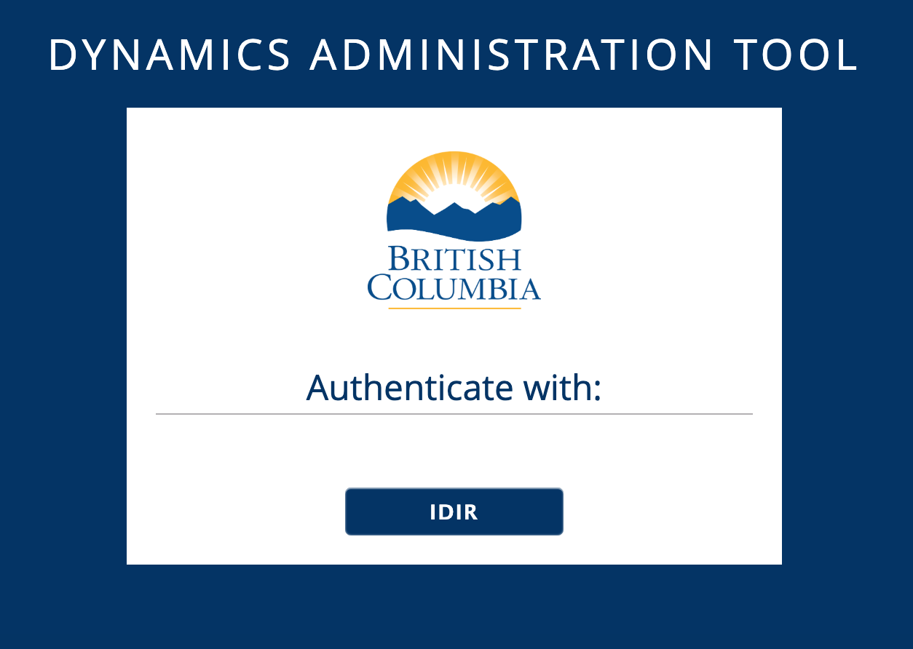
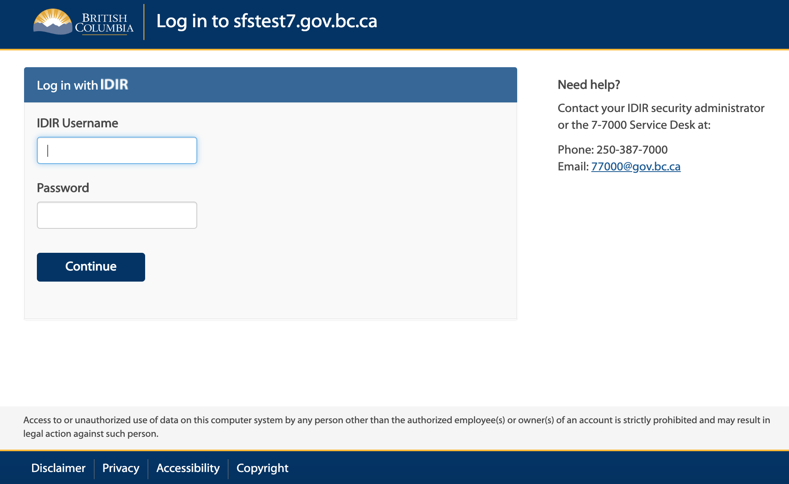
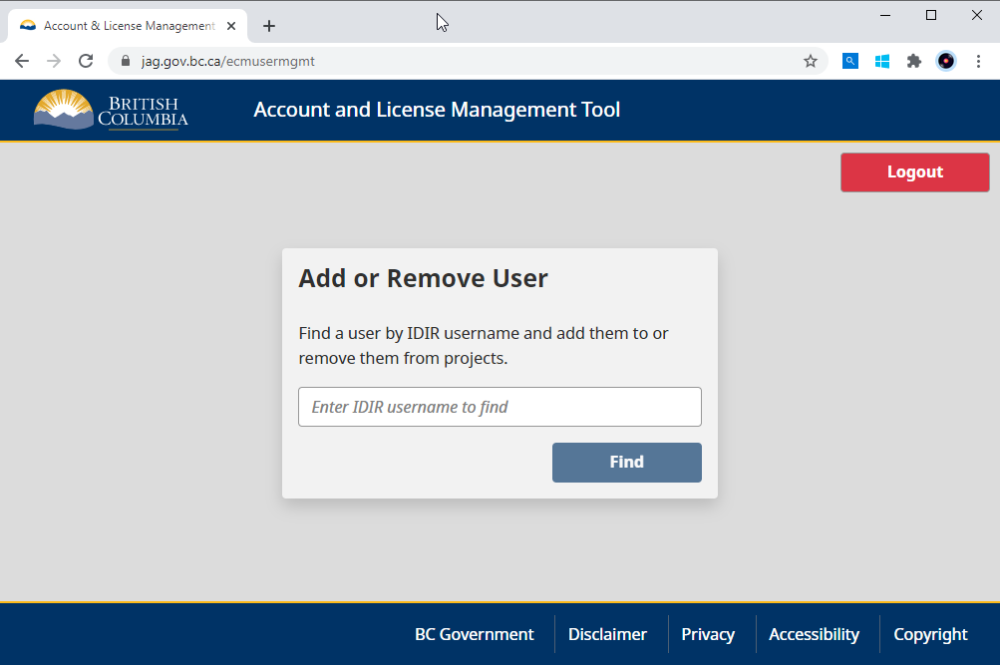

# MALTD

Management of Accounts and Licensing Tool for Dynamics/Sharepoint


## Application (Phase 1)

The Account Management and Licensing tool can be used to help manage the access of various projects and resources for different users. An administrator can log into the application using their IDIR account as shown in Figure 1.0 and 2.0 below and then search for users while also being able to add and remove them from projects (shown in Figures 3.0 and 4.0).

### Figure 1.0 - Login landing page for application

</img>

### Figure 2.0 - Federated IDIR login

</img>

### Figure 3.0 - Application frontend

</img>

## Frontend Folder Structure

The folder structure for the frontend react application will be as follows:

```
my-app
├── build
├── public
│   ├── favicon.ico
│   ├── index.html
│   └── manifest.json
├── src
├── .gitignore
├── package.json
└── README.md
```

- `build` is the location of the final, production-ready build.
- `public` is where the static files will reside.
- `src` is where the dynamic files will reside.

`src` will look something like this:

```
src
├── components
│   └── app
│   │   ├── app.css
│   │   ├── app.js
│   │   └── app.test.js
│   └── index.js
├── images
│   └── logo.svg
├── index.css
├── index.js
└── service-worker.js
```

All the react components will be found in the `components` directory. The `components/index.js` file will serve as a barrel through which all sibling components are exported.

Since we are using storybook and CDD, each component will be its own directory with the component code, styling, tests, as well as `.stories.js` file.

This is pretty much what `create react app` provides out of the box, except slightly modified and adjusted to better suit CDD and focusing on component-first design and development.
